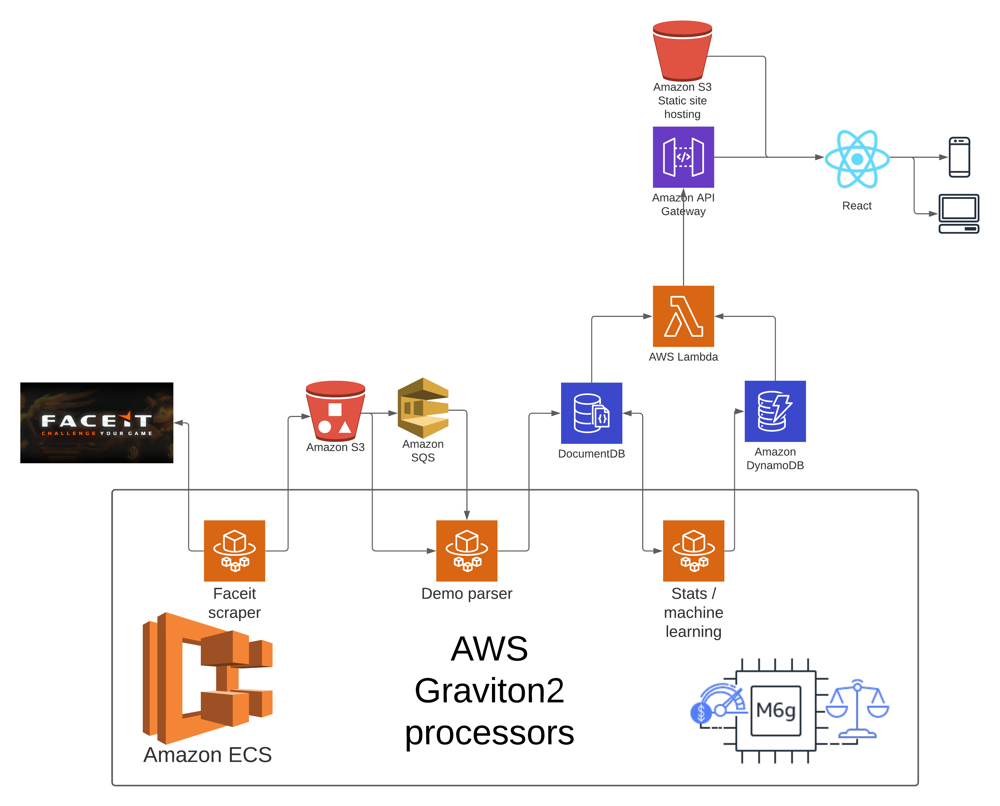

# Bantr

Bantr is an application for data analysis of Counter Strike: Global Offensive (CSGO) matches.

We use ingame recordings called [demo files](https://developer.valvesoftware.com/wiki/DEM_Format) to detect lots of information during games. The system consists of different modules, which are responsible for different tasks. In this README, you will find a high-level overview of each module. For more details, you can find a README in the respective module folder.

You can find a deployed instance of this app at https://bantr.app/ (until I get tired of paying the AWS bill :))

Everything is managed and deployed with AWS CDK.

## Faceit scraper

Faceit is a third-party service for CS:GO matches. They provide demo files for each match played. Our scraper downloads these demo files and stores them in S3 for further processing.

The S3 bucket has a trigger, which is executed every time a new file is uploaded to the bucket. It pushes a new message to SQS.

## Demo parser

Downloads demos from S3 and parses them (didn't expect that did you :)). This is a rather CPU-intensive task which makes for an ideal candidate to run on Graviton2 processors.

Once the demo file is parsed, all data is written to DocumentDB.

## Stats / machine learning

### Stats

The stats module reads data from DocumentDB and calculates global statistics. We write the results of these calculations to DynamoDB so they can be quickly read by the API. 

### Machine learning

We made a ML algorithm that tries to predict the outcome of a round after certain events have happened.

// TODO: Emiel expand on this maybe?

## API

The API consists of several Lambda functions. Each function talks to either DocumentDB or DynamoDB to fetch data.

## Frontend

The frontend was written with React using Umi as a framework and Ant Design as component library.